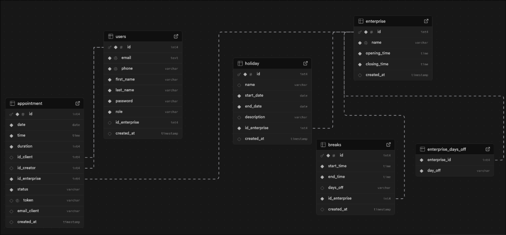

# Workshop Zepcla API

## Db schema


## Authentication
Routes prefixed with `/logged/` require a valid JWT token:
```
Authorization: Bearer <token>
```

---

## Auth — `/auth`

| Method | Route | Role | Description |
|--------|-------|------|-------------|
| POST | `/auth/register` | PUBLIC | Register a new client account |
| POST | `/auth/login` | PUBLIC | Login and get JWT token |
| POST | `/auth/logged/admin/create` | ADMIN | Create a new admin linked to an enterprise |

### POST `/auth/register`
```json
{
  "email": "client@test.com",
  "password": "password123",
  "firstName": "John",
  "lastName": "Doe",
  "phoneNumber": "0479000001",
  "tokenRdv": null,
  "enterpriseId": null
}
```

### POST `/auth/login`
```json
{
  "email": "client@test.com",
  "password": "password123"
}
```
**Response:**
```json
{
  "accessToken": "eyJhbGciOiJIUzI1NiJ9..."
}
```

### POST `/auth/logged/admin/create`
```json
{
  "email": "admin@test.com",
  "password": "password123",
  "firstName": "Jane",
  "lastName": "Admin",
  "phoneNumber": "0479000002",
  "tokenRdv": null,
  "enterpriseId": 1
}
```
**Rules:**
- `enterpriseId` is required for admin creation

---

## Users — `/logged/users`

| Method | Route | Role | Description |
|--------|-------|------|-------------|
| GET | `/logged/users/me` | CLIENT, ADMIN | Get current user |
| GET | `/logged/users/all` | ADMIN | Get all users |
| GET | `/logged/users/{id}` | ADMIN | Get user by ID |
| GET | `/logged/users/by-email?email=` | ADMIN | Get user by email |
| GET | `/logged/users/by-name?firstName=&lastName=` | ADMIN | Get user by name |
| GET | `/logged/users/search` | ADMIN | Search users with filters |
| GET | `/logged/users/create/admin` | ADMIN, SUPERADMIN | Create admin from logged route |
| GET | `/logged/users/debug-auth` | ANY | Debug current user authorities |
| PUT | `/logged/users/update/me` | CLIENT, ADMIN | Update current user |
| PUT | `/logged/users/update/{id}` | ADMIN | Update user by ID |
| DELETE | `/logged/users/delete/me` | CLIENT, ADMIN | Delete current user |
| DELETE | `/logged/users/delete/{id}` | ADMIN | Delete user by ID |

### PUT `/logged/users/update/me`
### PUT `/logged/users/update/{id}`
```json
{
  "email": "client@test.com",
  "password": "newpassword123",
  "firstName": "John",
  "lastName": "Doe",
  "phoneNumber": "0479000001",
  "tokenRdv": null,
  "enterpriseId": null
}
```

### GET `/logged/users/search`
| Param | Type | Required | Description |
|-------|------|----------|-------------|
| page | Integer | No (default: 0) | Page number |
| size | Integer | No (default: 10) | Page size |
| id | Long | No | Filter by ID |
| firstName | String | No | Filter by first name |
| lastName | String | No | Filter by last name |
| email | String | No | Filter by email |
| role | String | No | Filter by role (CLIENT, ADMIN) |
| phoneNumber | String | No | Filter by phone number |

---

## Enterprises — `/enterprises`

| Method | Route | Role | Description |
|--------|-------|------|-------------|
| POST | `/enterprises/create` | ADMIN | Create an enterprise |
| GET | `/enterprises/all` | ADMIN | Get all enterprises |
| GET | `/enterprises/MyEnterprise` | ADMIN | Get current admin's enterprise |
| GET | `/enterprises/MyEnterprise/details` | ADMIN | Get enterprise with breaks and holidays |
| GET | `/enterprises/MyEnterprise/breaks` | ADMIN | Get enterprise with breaks only |
| GET | `/enterprises/MyEnterprise/holidays` | ADMIN | Get enterprise with holidays only |
| PUT | `/enterprises/MyEnterprise/update` | ADMIN | Update current admin's enterprise |
| DELETE | `/enterprises/delete/{id}` | SUPERADMIN | Delete an enterprise |

### POST `/enterprises/create`
```json
{
  "name": "Workshop Test",
  "openingTime": "08:00:00",
  "closingTime": "18:00:00",
  "daysOff": ["SUNDAY"]
}
```

### PUT `/enterprises/MyEnterprise/update`
```json
{
  "name": "Workshop Updated",
  "openingTime": "09:00:00",
  "closingTime": "17:00:00",
  "daysOff": ["SATURDAY", "SUNDAY"]
}
```
`daysOff` accepts: `MONDAY, TUESDAY, WEDNESDAY, THURSDAY, FRIDAY, SATURDAY, SUNDAY`

---

## Holidays — `/holidays`

| Method | Route | Role | Description |
|--------|-------|------|-------------|
| POST | `/holidays/create` | ADMIN | Create a holiday period |
| GET | `/holidays/all` | ADMIN | Get all holidays |
| GET | `/holidays/{id}` | ADMIN | Get holiday by ID |
| GET | `/holidays/by-enterprise/{id_enterprise}` | ADMIN | Get holidays by enterprise |
| PUT | `/holidays/update/{id}` | ADMIN | Update a holiday |
| DELETE | `/holidays/delete/{id}` | ADMIN | Delete a holiday |

### POST `/holidays/create`
```json
{
  "name": "Summer closure",
  "startDate": "2026-07-15",
  "endDate": "2026-08-15",
  "enterpriseId": 1,
  "description": "Annual summer break"
}
```

### PUT `/holidays/update/{id}`
```json
{
  "name": "Summer closure updated",
  "startDate": "2026-07-20",
  "endDate": "2026-08-20",
  "enterpriseId": 1,
  "description": "Updated summer break"
}
```
**Rules:**
- `startDate` must be before or equal to `endDate`
- `endDate` cannot be in the past

---

## Breaks — `/breaks`

| Method | Route | Role | Description |
|--------|-------|------|-------------|
| POST | `/breaks/create` | ADMIN | Create a break |
| GET | `/breaks/all` | ADMIN | Get all breaks |
| GET | `/breaks/{id}` | ADMIN | Get break by ID |
| GET | `/breaks/by-enterprise/{id_enterprise}` | ADMIN | Get breaks by enterprise |
| PUT | `/breaks/update/{id}` | ADMIN | Update a break |
| DELETE | `/breaks/delete/{id}` | ADMIN | Delete a break |

### POST `/breaks/create`
### PUT `/breaks/update/{id}`
```json
{
  "startTime": "12:00:00",
  "endTime": "13:00:00",
  "daysOff": "MONDAY",
  "enterpriseId": 1
}
```
**Rules:**
- `startTime` must be before `endTime`
- Break must be within enterprise opening hours
- Break cannot overlap with existing breaks on the same day
- `daysOff` accepts: `MONDAY, TUESDAY, WEDNESDAY, THURSDAY, FRIDAY, SATURDAY, SUNDAY`

---

## Appointments — public `/appointments/public`

| Method | Route | Role | Description |
|--------|-------|------|-------------|
| POST | `/appointments/public/create` | PUBLIC | Create appointment without account |
| GET | `/appointments/public/consult?token=` | PUBLIC | Consult appointment by token |
| PUT | `/appointments/public/cancel?token=` | PUBLIC | Cancel appointment by token |

### POST `/appointments/public/create`
```json
{
  "date_appointment": "2026-04-10",
  "time_appointment": "10:00:00",
  "duration": 60,
  "enterpriseId": 1,
  "email_client": "public@test.com"
}
```

---

## Appointments — `/logged/appointments`

| Method | Route | Role | Description |
|--------|-------|------|-------------|
| POST | `/logged/appointments/create` | CLIENT, ADMIN | Create appointment for current user |
| POST | `/logged/appointments/admin-create` | ADMIN | Create appointment for a specific client |
| PUT | `/logged/appointments/cancel/{id}` | CLIENT, ADMIN | Cancel an appointment (min 12h before) |
| GET | `/logged/appointments/all` | ADMIN | Get all appointments |
| GET | `/logged/appointments/{id}` | ADMIN | Get appointment by ID |
| GET | `/logged/appointments/by-date?date=` | ADMIN | Get appointments by date |
| GET | `/logged/appointments/by-client/{id_client}` | ADMIN | Get appointments by client ID |
| GET | `/logged/appointments/by-creator/{id_creator}` | ADMIN | Get appointments by creator ID |
| GET | `/logged/appointments/my-appointments` | CLIENT, ADMIN | Get current user appointments |
| GET | `/logged/appointments/my-appointments/by-date?date=` | CLIENT, ADMIN | Get current user appointments by date |
| GET | `/logged/appointments/search` | ADMIN | Search appointments with filters |

### POST `/logged/appointments/create`
```json
{
  "date_appointment": "2026-04-07",
  "time_appointment": "10:00:00",
  "duration": 60,
  "enterpriseId": 1
}
```

### POST `/logged/appointments/admin-create`
Enterprise is automatically taken from the authenticated admin's enterprise.
```json
{
  "date_appointment": "2026-04-08",
  "time_appointment": "14:00:00",
  "duration": 30,
  "id_client": 1
}
```

### GET `/logged/appointments/search`
| Param | Type | Required | Description |
|-------|------|----------|-------------|
| page | Integer | No (default: 0) | Page number |
| size | Integer | No (default: 10) | Page size |
| id | Long | No | Filter by ID |
| date | String | No | Filter by date (yyyy-MM-dd) |
| time | String | No | Filter by time (HH:mm:ss) |
| duration | String | No | Filter by duration (minutes) |
| status | String | No | Filter by status (PLANIFIED, CANCELLED) |
| token | String | No | Filter by token |

---

## Error cases

### RDV in the past
```json
{
  "date_appointment": "2024-01-01",
  "time_appointment": "10:00:00",
  "duration": 60,
  "enterpriseId": 1
}
```

### RDV on daysOff (Sunday)
```json
{
  "date_appointment": "2026-04-05",
  "time_appointment": "10:00:00",
  "duration": 60,
  "enterpriseId": 1
}
```

### RDV during break (Monday 12h)
```json
{
  "date_appointment": "2026-04-06",
  "time_appointment": "12:00:00",
  "duration": 60,
  "enterpriseId": 1
}
```

### RDV during holiday
```json
{
  "date_appointment": "2026-07-25",
  "time_appointment": "10:00:00",
  "duration": 60,
  "enterpriseId": 1
}
```

### RDV outside opening hours
```json
{
  "date_appointment": "2026-04-07",
  "time_appointment": "07:00:00",
  "duration": 60,
  "enterpriseId": 1
}
```

### Break overlap
```json
{
  "startTime": "12:30:00",
  "endTime": "13:30:00",
  "daysOff": "MONDAY",
  "enterpriseId": 1
}
```

### Holiday in the past
```json
{
  "name": "Past holiday",
  "startDate": "2024-01-01",
  "endDate": "2024-01-10",
  "enterpriseId": 1,
  "description": "Should fail"
}
```

### Holiday dates inverted
```json
{
  "name": "Bad dates",
  "startDate": "2026-08-15",
  "endDate": "2026-07-15",
  "enterpriseId": 1,
  "description": "Should fail"
}
```

### Admin without enterprise
```json
{
  "email": "admin3@test.com",
  "password": "password123",
  "firstName": "Bad",
  "lastName": "Admin",
  "phoneNumber": "0479000003",
  "tokenRdv": null,
  "enterpriseId": null
}
```

---

## Business Rules

### Appointment creation
- Cannot create appointment in the past
- Cannot create appointment on enterprise day off (`daysOff`)
- Cannot create appointment during a holiday period
- Cannot create appointment during a break
- Appointment must start and end within opening hours
- Cannot create duplicate appointment (same client, same date, same time)
- Slot must be available (no other appointment at same date/time)
- Admin enterprise is automatically used for admin-create

### Appointment cancellation
- Must be cancelled at least **12 hours** before the appointment
- A `CANCELLED` appointment cannot be cancelled again
- A CLIENT can only cancel their own appointments
- An ADMIN can cancel any appointment

### Admin creation
- `enterpriseId` is required
- Admin is automatically linked to the enterprise

### Error responses
| HTTP Code | Situation |
|-----------|-----------|
| 400 | Invalid date/time, past date, invalid schedule, missing enterpriseId |
| 403 | Unauthorized access |
| 404 | Resource not found |
| 409 | Conflict (slot taken, already cancelled, overlap) |
